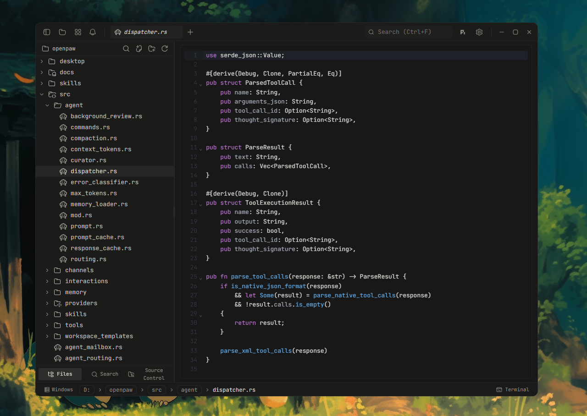

<div align="center">
  
  <h1>Agni</h1>
  <p><strong>A fast, lightweight code editor with a native terminal and Pi built in.</strong></p>
  <p>
    <a href="https://github.com/deviprasadshetty-dev/Agni">
      
    </a>
    
  </p>
</div>

---

**Agni** is a Tauri 2 + Rust desktop app that puts a code editor, a native terminal, a browser preview, an HTTP client, and an AI pair programmer (Pi) in one window. Open a folder, edit code, run commands, preview what you're building, fire off a request, and hand any of it to Pi without switching apps. Lightweight by design: no Electron, no bundled browser runtime, just a native webview and a Rust backend.

<p align="center">
  
</p>

## Features

### Code editor
- CodeMirror 6 (TS/JS, Rust, Python, Go, C/C++, Java, HTML/CSS, JSON, Markdown, and more)
- Vim mode
- Ten built-in themes: Atom One, Aura, Copilot, GitHub, Gruvbox, Nord, Tokyo Night, Xcode

### Terminal
- xterm.js with a WebGL renderer, multiple panes with background streaming
- Native PTY backend via `portable-pty` (zsh, bash, pwsh, fish, cmd)
- Split panels, horizontal and vertical
- Inline search, link detection, true color
- WSL workspace environments on Windows

### Pi, built in
- A native AI pair-programmer panel, not a bolted-on chat widget -- steer it mid-run or queue a follow-up for later
- Model and thinking-level picker, session history, fork / clone / rename / export
- `@file` mentions pull any workspace file into context as you type
- Attach images straight into the conversation
- Open Pi as a full tab for a distraction-free session, or keep it docked as a side panel
- Detects Claude Code, Codex, OpenCode, Agy, and Gemini too when run directly in a terminal pane -- tab indicator, auto-rename, and an OS notification when one needs attention

### Web preview
- Auto-detects local dev servers and opens them in a preview tab
- Click an element in the preview, annotate it, and send the note straight to Pi

### HTTP client
- Method, URL, headers, and body editor for one-off requests
- Import a request straight from a `curl` command
- Inspect status, latency, and response body; send a response to Pi for debugging

### Source control
- Stage / unstage hunks, commit, push with upstream awareness
- Git history pane with commit graph
- Commit search and filter

### File explorer
- Monochrome, theme-tinted file/folder icons that match whatever theme is active instead of a fixed palette
- Fuzzy search, keyboard navigation, inline rename, context actions

### Themes
- Built-in presets + custom theme engine
- Background images with adjustable opacity and blur
- Independent editor theme

## Build from source

**Prerequisites**
- Rust (stable), https://rustup.rs
- Node 22+ and [pnpm](https://pnpm.io)
- Tauri prerequisites for your platform, https://tauri.app/start/prerequisites/

```bash
pnpm install
pnpm tauri dev          # development
pnpm tauri build        # production bundle
```

## Tech stack

Tauri 2, Rust, `portable-pty`, React 19, TypeScript, Vite, xterm.js, CodeMirror 6, Tailwind v4, shadcn/ui, Zustand, Streamdown.

## License

Apache-2.0
